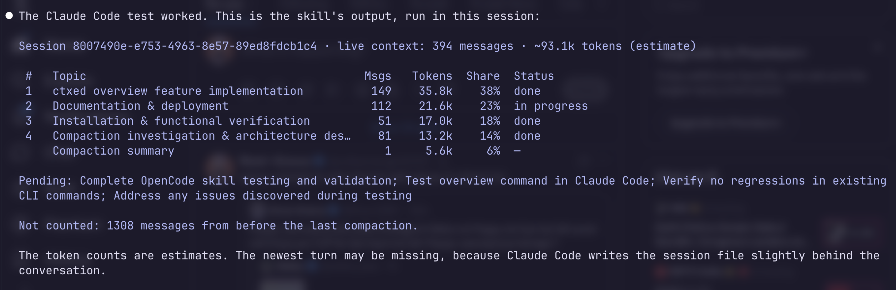
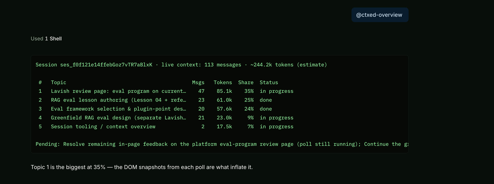

# ctxed

[](https://github.com/simranjeetc/ctxed/actions/workflows/ci.yml)

See what an agent session's **context** is made of: which topics it holds, how
many tokens each takes, which are done, and what is still pending. Works the same
in Claude Code and OpenCode. Read-only — ctxed never changes a session.




## Install

```sh
curl -fsSL https://github.com/simranjeetc/ctxed/releases/latest/download/install.sh | sh
```

Installs the `ctxed` binary and the `ctxed-overview` skill for Claude Code and
OpenCode. Update later with `ctxed update`. Prefer Go?
`go install github.com/simranjeetc/ctxed/cmd/ctxed@latest`.

## Inside a session: the `ctxed-overview` skill

One skill, [`skills/ctxed-overview/`](skills/ctxed-overview/), for both
harnesses. Ask *"what's in my context?"* (or `/ctxed-overview`); the agent runs
`ctxed overview` and shows the table as printed. It resolves the session from the
harness it runs in — `CLAUDE_CODE_SESSION_ID` → `~/.claude/projects/*/<id>.jsonl`,
`OPENCODE_SESSION_ID` → `opencode session export <id>`. There is no plugin and
nothing in the request path.

## Usage

```
ctxed overview [<session>] [--session ID] [--json] [--categorizer-cmd CMD] [--max-categories N] [--no-model]
ctxed inspect <session> [--json] [--model M] [--tokenizer ENC]
ctxed categorize <session> [--model M] [--base-url URL] [--api-key K]
                 [--categorizer-cmd CMD] [--max-categories N] [--out FILE]
ctxed update [--check] [--force]
```

`<session>` is a Claude Code transcript (`.jsonl`) or an OpenCode export
(`opencode session export <id> > s.json`).

| Command | What it does |
| --- | --- |
| `overview` | Topics in the live context, each with messages, tokens, share and status, plus what is still pending. The reason to use ctxed. |
| `inspect` | Every live entry: index, role, kind, tokens, first-line preview. The raw rows `overview` sums. |
| `categorize` | Group entries into 2–5 categories and write an editable `<name>.categories.json`. |
| `update` | Replace the binary with the latest release, verified against `checksums.txt`. `--check` only reports; `--force` reinstalls. |

**Live context only.** Entries after the last compaction; the compaction is its
own row (Claude Code's summary, or OpenCode's summary plus the kept tail). Every
live message lands in exactly one row, and the totals match `ctxed inspect`.

**No model call:** `overview --no-model` skips the categorizer and prints the
whole-session sizes as one row, sending nothing anywhere. `overview` and
`categorize` otherwise send excerpts to the categorizer (the harness's own cheap
model by default, or whatever `--categorizer-cmd` / `--model` / `--base-url`
select). Those excerpts leave the machine only if that model is remote.

**Token counts** are estimates (one token per four runes) labelled `estimate`.
Name a model or encoding for a real tokenizer: `--model gpt-4o`,
`--tokenizer cl100k_base`.

## Exit codes

| Code | Meaning |
| --- | --- |
| 0 | success (also when only the topic names were unavailable) |
| 1 | runtime error (missing file or transcript, unrecognized format) |
| 2 | usage error (no session, ambiguous session, unsafe session id) |

## Development

```sh
go test ./...                            # offline, deterministic
scripts/verify-functionally.sh --all     # real Claude Code + OpenCode sessions, cheap models
```

Test fixtures under `testdata/` are trimmed, schema-faithful samples of a real
OpenCode export and a real Claude Code transcript.

See [`docs/adapters.md`](docs/adapters.md) for the session-format boundary.
